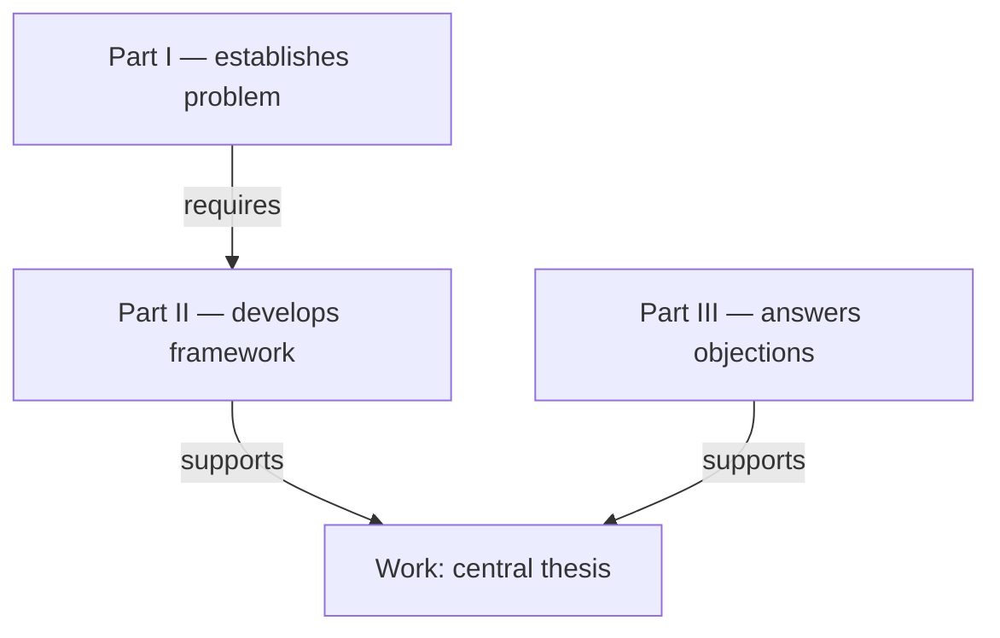

# Discourse Atlas — Remote Agent Protocol

Protocol version: **1.1.0**

This document is a self-contained, zero-install entry point for AI agents with web or file-reading access. It tells you how to reconstruct the argumentative architecture of a source document using Discourse Atlas.

**Do not require the user to install Discourse Atlas.** If you can read this protocol and the source, you can perform the reconstruction directly. Local tools, the Python package, and the web viewer are optional helpers.

Canonical remote entry point:

`https://raw.githubusercontent.com/ChongLiuPhil/discourse-atlas/main/AGENT.md`

Hosted Interactive Atlas:

`https://chongliuphil.github.io/discourse-atlas/`

## Goal

Given an argumentative or expository source — essay, paper, chapter, book, report, legal argument, or similar document — reconstruct it from **whole-work architecture down to local arguments**.

The result should answer four questions at every useful scale:

1. **What textual unit is this?**
2. **What is its main claim?**
3. **What function does it perform here?**
4. **How does it depend on, support, refine, contrast with, object to, or respond to other units?**

Do not produce a flat summary. Produce a hierarchical argument map.

## Non-negotiable principles

- Recover structure before writing a global summary.
- Preserve author-provided chapters, sections, and headings whenever present.
- Mark AI-inferred segmentation explicitly as `structure_origin: inferred`.
- Keep **containment hierarchy** separate from **logical/discourse dependencies**.
- Do not infer logical dependence merely from textual order.
- Important relations should point back to source evidence when possible.
- Prefer a sparse, defensible graph over a dense speculative graph.
- Represent uncertainty with confidence and assertion level.
- Treat the result as a criticizable reconstruction, not the uniquely true structure.
- Never invent text, headings, page numbers, quotations, or coordinates that you cannot verify from the source.

## Required analysis dimensions

For each meaningful unit, distinguish:

- `title`: authorial heading, or a conservative inferred label;
- `main_claim`: the proposition or thesis the unit advances, if it advances one; otherwise `null`;
- `summary`: what the unit discusses or does in concise prose;
- `function`: one or more discourse functions, such as `defines`, `distinguishes`, `motivates`, `argues`, `objects`, `responds`, `illustrates`, `synthesizes`, `concludes`;
- `role_in_parent`: why this unit is needed inside its parent unit;
- source anchors and confidence.

**`main_claim` is not the same as `summary`.** A summary may describe a section that raises a problem, defines a term, surveys alternatives, or gives an example even when no single assertoric claim should be forced onto it.

## Macro-to-micro workflow

### 1. Read the source and recover authorial hierarchy

Identify the work, parts, chapters, sections, subsections, paragraphs, and smaller argument units as needed. Preserve explicit structure. Infer only missing structure.

### 2. Build the work map first

Before expanding local details, identify:

- the work's central problem or task;
- the work's central thesis or intended conclusion, when there is one;
- the major stages of the composition;
- the main claim of each major part/chapter;
- why each major part is needed for the work as a whole;
- the most important cross-part dependencies.

The first view should remain readable even for a long book.

### 3. Recurse into chapters and sections

For each major unit, repeat the same analysis at the next level. A chapter map should explain how its sections jointly establish, qualify, motivate, challenge, or apply the chapter-level claim.

### 4. Reconstruct local arguments only where useful

At the finest useful level, identify premises, distinctions, objections, replies, examples, and derived claims. Do not atomize every sentence by default.

### 5. Add discourse relations

Every relation has a directed `source -> target` orientation unless noted otherwise:

- `requires`: prerequisite -> dependent
- `supports`: supporting reason/evidence -> supported claim
- `derives`: basis -> derived result
- `refines`: refining/qualifying unit -> unit refined
- `contrasts`: deliberate contrast; semantically symmetric even though stored as an edge
- `objects_to`: objection -> target
- `responds_to`: response -> objection/problem
- `illustrates`: example/application -> general point
- `sequence`: earlier organizational stage -> later stage; **not** logical dependence

Use only relations that clarify the architecture.

### 6. Evidence and uncertainty audit

Check that:

- every node and edge endpoint exists;
- relation direction matches the ontology;
- major edges have a short explanation;
- major edges have evidence anchors when the source permits it;
- authorial and inferred structure remain distinguishable;
- uncertain interpretations are labeled rather than silently asserted.

## Source anchors

Use only coordinates genuinely available from the source:

- paragraph ranges: 1-based, inclusive;
- line ranges: 1-based, inclusive;
- page ranges: 1-based, inclusive;
- `char_start`: 0-based inclusive Unicode code-point offset;
- `char_end`: 0-based exclusive Unicode code-point offset.

If the source is a PDF and you have reliable page numbers but not exact character offsets, use page anchors only. If the source is inaccessible, say so and request the text or an accessible link rather than reconstructing from guesses.

## Output contract

Produce the following in this order.

### A. Global Architecture

A concise account of the whole work:

- central problem/task;
- central thesis or target conclusion;
- major argumentative stages;
- major dependencies between those stages;
- important alternative readings or uncertainty.

### B. Macro Argument Map

Give a readable top-level map, preferably Mermaid when supported. Keep it to work/part/chapter scale unless the source is short.

Example shape:

Do not place hundreds of local nodes in the first map.

### C. Hierarchical Reconstruction

For each major unit report:

- title;
- main claim;
- function;
- role in parent;
- important children;
- important incoming/outgoing relations;
- confidence/evidence.

Then recurse only as far as useful for the user's purpose.

### D. Canonical Discourse Atlas JSON

When the environment can return structured data or files, produce `analysis.json` conforming to:

`https://raw.githubusercontent.com/ChongLiuPhil/discourse-atlas/main/schemas/discourse-graph.schema.json`

New output should declare `schema_version: "0.2.0"`. The validator also supports the terminal legacy `0.1.0` compatibility profile for older analyses; do not emit new analyses as `0.1.0`.

The user can inspect that JSON in the hosted Interactive Atlas at:

`https://chongliuphil.github.io/discourse-atlas/`

The full installed Agent Skill is available at:

`https://raw.githubusercontent.com/ChongLiuPhil/discourse-atlas/main/skills/discourse-structure/SKILL.md`

The relation ontology is available at:

`https://raw.githubusercontent.com/ChongLiuPhil/discourse-atlas/main/skills/discourse-structure/references/relation-ontology.md`

If you cannot fetch those secondary files, this document is sufficient to perform a useful reconstruction. Do not stop merely because the local package is unavailable.

## Long-document rule

For books and long papers, use progressive disclosure:

**work map -> part/chapter map -> section map -> local argument map**.

The map should become more detailed when the user drills down, not more crowded at the top level.

## User-facing completion criterion

A successful Discourse Atlas analysis lets a reader see, at a glance:

- what the work is trying to establish;
- which major parts establish which claims;
- how those parts depend on one another;
- where objections and replies occur;
- how to drill from the whole work into chapter- and section-level argument structure;
- where important reconstructed relations are grounded in the source.
